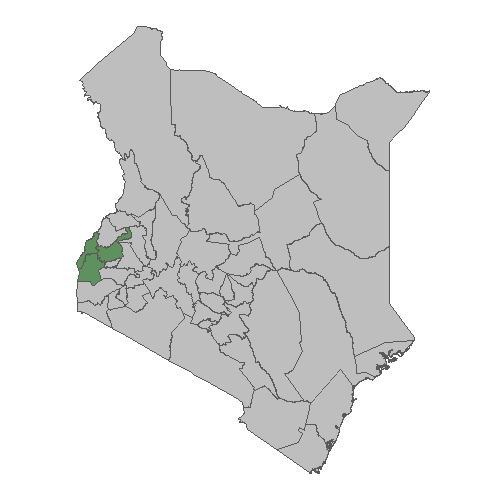
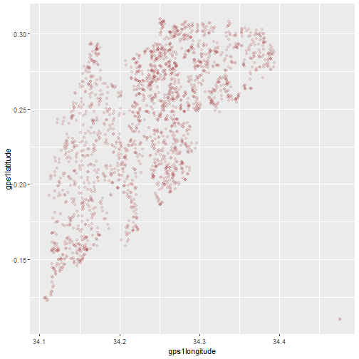
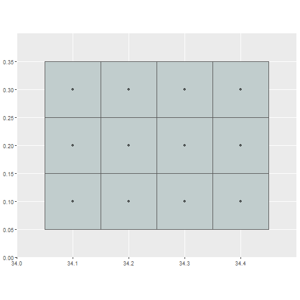
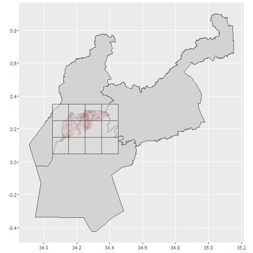
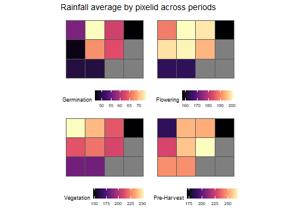
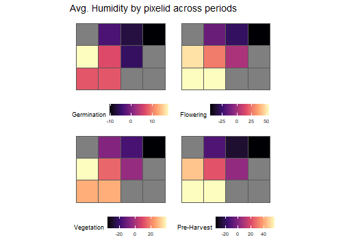
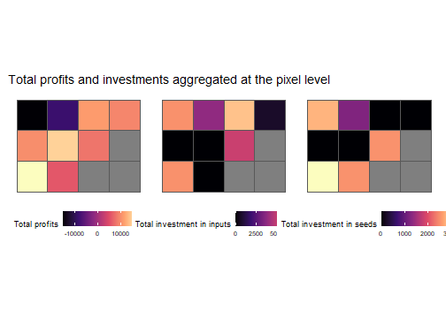

Predicting farmer's profits in rural Kenya
========================================================
author: Giuliana Daga
date: 12/02/2020
autosize: true
Problem statement and background
========================================================

- Client: The product is piloted by Agriculture and Climate Risk Enterprise (ACRE), working in Kenya since 2009.
- Index-based insurance insurance links payouts not to actual crop losses but to exogenous events (in their case, rains).
- However, basis risk is an issue, given that the correlation between payouts (calculated over rain amounts) and actual yields is imperfect.

Our goal is twofold: transform a previous statistical analysis into a geospatial one with good visualizations: and include more weather variables to improve ACRE's model and protect better farmers against weather hazards.

Where are our farmers?
========================================================

How is ACRE aggregating farmers to calculate their payouts?
========================================================

What are they using to calculate payouts?
========================================================

Currently, they are only using IRI/LDEO Climate Data Library daily rainfall data. They aggregate data into four periods: germination, flowering, vegetation and pre-harvest.

How can we improve their model?
========================================================
Giovanni - NASA Data Collection: humidity, soil moisture, surface air temperature, pressure, wind speed, evapotranspiration, etc.

Outcome: Total profits in Short rains season 2018
========================================================

We have extensive data for each farmers: like investment on inputs, seeds, acreage, household characteristics, etc.

Methods/ Approaches considered
========================================================
We will apply supervised learning methods using farmer's profits as an output and weather variables (divided by our 4 periods) as our input. 

We will follow the steps as learned in class: prepare and bake recipe, split data into training and test, and set cross/validation methods for all our statistical learning algorithms.
We will estimate:
- Regression trees
- Random Forest
- Support Vector Machines (svmPoly)
Preliminary results and conclusions
========================================================
So far, I overcame fundamental challenges: 
- building the fishnet (or grid) to fit pixel ids form the points provided by ACRE (using Arcmap)
- gather geospatial weather data for the right locations (Northern Siaya County) and time (short seasons 2018)
- manipulating data to be able to join them all together in one data frame.

Having the required data built, I will be able to follow steps for analysis. 
